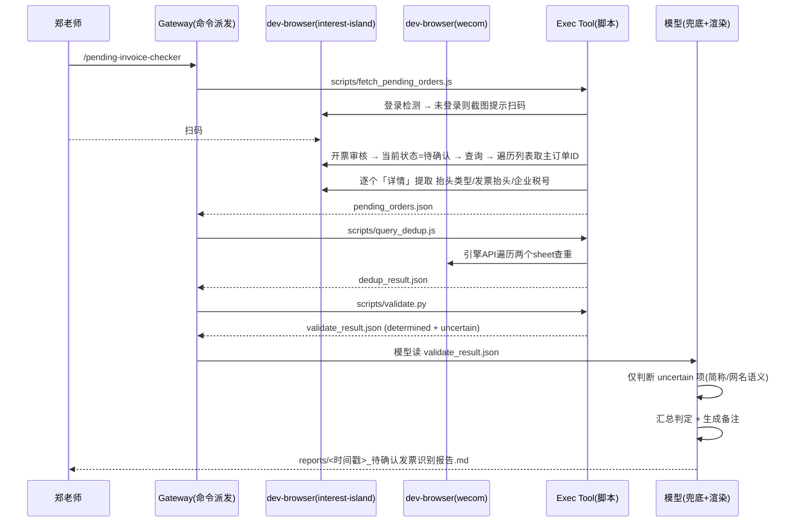

# pending-invoice-checker — 待确认发票识别器

独立只读 skill。批量拉取兴趣岛「开票审核」中状态为**待确认**的订单，逐个校验发票抬头/税号格式并查重企微表格，最终输出 `.md` 报告（主订单ID / 是否确认开票 / 备注）供郑老师人工确认。

> 本 skill **只读**，不修改/删除/创建任何订单或发票数据，也不进入后续开票流水线。

## 完整流程



## 阶段 1：采集（scripts/fetch_pending_orders.js）

1. 确保浏览器在线：`dev-browser status`，`interest-island` 实例 running
2. 写入输入文件（可选，默认空跑全量待确认）：
   ```json
   {"order_ids": ["9000000783104504"]}
   ```
   写入 `~/.dev-browser/tmp/pending_check_input.json`。`order_ids` 为空/缺省 → 自动遍历全部待确认订单
3. 运行：
   ```bash
   dev-browser --browser interest-island --idle-timeout 0 --timeout 180 run "C:\Users\EDY\.codebuddy\skills\pending-invoice-checker\scripts\fetch_pending_orders.js"
   ```
   - 脚本自动检测登录（URL 是否含 `/login`），未登录则截图并输出 `login_required`，等待用户扫码后重跑
   - 输出 `~/.dev-browser/tmp/pending_orders.json`（订单列表 + 详情字段）

## 阶段 2：查重（scripts/query_dedup.js）

1. 写入输入 `~/.dev-browser/tmp/dedup_input.json`：`{"orders": [...]}`（订单号列表）
2. 运行：
   ```bash
   dev-browser --browser wecom --idle-timeout 30m --timeout 120 run "C:\Users\EDY\.codebuddy\skills\pending-invoice-checker\scripts\query_dedup.js"
   ```
   - 引擎 API 遍历两个 sheet：`沐思和思坞开票` + `新增兴趣岛开票登记2`
   - 任一命中 → `found: true`
   - 输出 `~/.dev-browser/tmp/dedup_result.json`

## 阶段 3：规则校验（scripts/validate.py）

```bash
python "C:\Users\EDY\.codebuddy\skills\pending-invoice-checker\scripts\validate.py" \
  --orders "C:\Users\EDY\.dev-browser\tmp\pending_orders.json" \
  --dedup "C:\Users\EDY\.dev-browser\tmp\dedup_result.json" \
  --output "C:\Users\EDY\.dev-browser\tmp\validate_result.json"
```

- 纯规则校验，产出中间 JSON：`determined`（已确定项）+ `uncertain`（需大模型兜底项）
- 规则见 `references/rules.md`

## 阶段 4：模型兜底 + 渲染报告

模型读取 `validate_result.json`：
1. **仅对 `uncertain` 项**做语义判断（企业简称 vs 全称、网名 vs 真名），不重判 `determined` 项
2. 汇总判定「是否确认开票」+ 生成备注（原因码见 `references/rules.md`）
3. 按 `references/report_template.md` 渲染，写入 `reports/<时间戳>_待确认发票识别报告.md`

## 判定矩阵

规则：**全部校验通过才「是」，任一不通过 →「否」+ 原因码**，短路判断：

```
1. 查重命中(任一sheet)            → 否  ALREADY_INVOICED
2. 抬头类型 vs 抬头格式 明显不符    → 否  TITLE_TYPE_MISMATCH
3. 个人 → 姓名格式校验             → 失败:否 / 不确定:uncertain
   企业 → 抬头全称校验 + 税号校验   → 失败:否 / 不确定:uncertain
4. 全部通过                        → 是
```

原因码：`ALREADY_INVOICED` / `TITLE_TYPE_MISMATCH` / `TITLE_FORMAT_PERSONAL` / `TITLE_FORMAT_ENTERPRISE` / `TAX_ID_FORMAT`

## 运行时约束（QuickJS 沙箱）

脚本运行在 dev-browser 的 QuickJS WASM 沙箱，**不是 Node.js**：

| 不可用 | 替代 |
|---|---|
| `require('fs')` | 内置 `await readFile(name)` / `await writeFile(name, data)` |
| `require()` 整体 | 无模块加载，脚本自包含 |
| `let`/`const`(部分版本) | 用 `var` 更安全 |
| 箭头函数(page.evaluate 内) | 用 `function` 声明 |
| 双反斜杠路径 `"C:\\..."` | 单反斜杠 `"C:\..."`（双反斜杠静默崩溃） |

文件 I/O 路径自动限制在 `~/.dev-browser/tmp/`。

> **诊断与临时文件约定**：调试/校准信息一律用 `console.log` 输出到运行日志（dev-browser stdout），**不要在工作区生成临时诊断脚本**；确需 dump 的中间数据写 `~/.dev-browser/tmp/`（沙箱临时目录，用完即弃，不污染仓库）。工作区只保留 `scripts/`、`references/`、`reports/` 三类正式产物；若临时文件散落工作区，用一条 `Remove-Item` 命令批量清理，不要逐个删除。

## 关键踩坑记录（继承自已验证 skill）

| 问题 | 正确做法 |
|---|---|
| 日期筛选 | `delete listQuery.startTime/endTime`（不能设空字符串） |
| 详情面板漏检 | 滚动 `el-drawer__body` 到底再读取 |
| 登录检测 | 导航后检查 URL 是否含 `/login`，不用文本匹配 |
| 登录方式 | 兴趣岛登录页以「手机号+验证码」为主，右下角放大镜图标才是扫码；提示文案勿只写「扫码」 |
| 企微查重 | 引擎 API `getCellDataAtPosition` 遍历，不用 Ctrl+F |
| 脚本入口 | 顶层 `await main()`，不能用 `main().then()`（会被截断） |

## 约束

1. **只读**：禁止点击「换营」「追赠」「复制链接」等修改/分享按钮，只允许点「详情」
2. **禁止固定坐标**：Vue 直驱 + 文本定位
3. **禁止保存密码/模拟扫码**：仅复用用户扫码 session
4. **首次运行验证点**：开票审核页的 Vue 组件路径、状态筛选字段名与「待确认」值、订单 ID 列位置、详情字段名（脚本顶部 `CONFIG` 集中配置，首次跑时按日志 dump 校准）

## 文件结构

```
pending-invoice-checker/
├── SKILL.md                        ← 本文件
├── references/
│   ├── rules.md                    ← 校验规则库 + 原因码枚举
│   └── report_template.md          ← 报告模板({{PLACEHOLDER}})
└── scripts/
    ├── fetch_pending_orders.js     ← 阶段1: 登录+遍历待确认+详情提取
    ├── query_dedup.js              ← 阶段2: 双sheet引擎API查重
    └── validate.py                 ← 阶段3: 规则校验, 出中间JSON(含uncertain)
```
